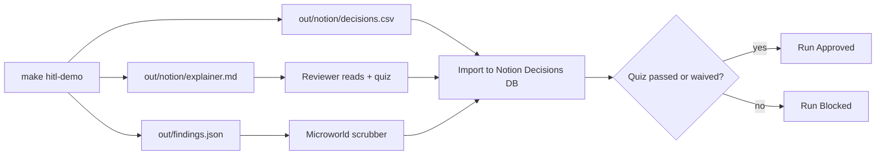

# Notion HITL — Shared Space Spec

This document defines the **Shared space** for Dataroom Reviewer human-in-the-loop workflows, inspired by Geoffrey Litt's *Explanations / Micro worlds / Shared spaces* framing ([talk](https://www.youtube.com/watch?v=WkBPX-oDMnA)).

## Production review vs training microworld

| Surface | Path | Data | Purpose |
|---------|------|------|---------|
| **Production reviewer** | `/review/<job_id>` (Flask) | Real scan scoring JSON → `findings.json` (`S001…`) | Lock agree/override/defer on live or dry-run scans |
| **Training microworld** | `hitl/microworld/index.html` | VertiGreen fixtures (`F001…`) + quiz gate | ≤10 min training loop before Notion |

Both export locks compatible with `microworld-locks.schema.json` v1 (`fixture_path` ← `source_path` for production). **Notion push stays env-token only** — `scripts/push_microworld_to_notion.py` on Infra/Hands; never embed tokens in HTML/JS.

Production v1: locks autosave to `output/{job_id}-review-locks.json` on every lock; localStorage is recovery cache only. Optional Notion push after Playground choose. Upload may already have completed — decisions are audit trail until a future HITL gate blocks PDF/upload.

## Purpose

The Decisions database is the multiplayer surface where:

1. The **agent** creates rows after each fixture scan (`make hitl-demo`)
2. The **human reviewer** sets `Human decision`, `Rationale`, and `Quiz passed`
3. The **run** is gated: **Approved** only if quiz passed or explicitly waived

No live Notion write is required for v1 — import `out/notion/decisions.csv` or use the JSON template.

## Database: Decisions

| Property | Type | Set by | Description |
|----------|------|--------|-------------|
| **Finding ID** | Title | Agent | Stable ID from `findings.json` (e.g. `F004`) |
| **Fixture path** | Text | Agent | Relative path under `fixtures/sample-dataroom/` |
| **Agent suggestion** | Text | Agent | `{label} → {action}` (e.g. `needs_human → confirm_redaction`) |
| **Human decision** | Select | Human | `agree` \| `override` \| `defer` |
| **Rationale** | Text | Human | Why the human agreed or overrode the agent |
| **Quiz passed** | Checkbox | Human | True when reviewer completed explainer quiz |
| **Status** | Select | Human | `pending` \| `reviewed` \| `waived` \| `blocked` |
| **Run link** | URL | Agent | Link to `out/findings.json` or CI artifact |
| **Reviewer** | Person | Human | Gideon / assigned reviewer |

### Select options

**Human decision**

- `agree` — accept agent label and action
- `override` — different label or action (document in Rationale)
- `defer` — needs more context or external counsel

**Status**

- `pending` — default on import
- `reviewed` — human decision recorded
- `waived` — quiz or review explicitly waived (audit trail in Rationale)
- `blocked` — cannot proceed (e.g. missing fixture)

## Workflow

## Multiplayer rules

| Actor | Creates | Updates |
|-------|---------|---------|
| Agent (CI / Hands) | Rows, Run link, Agent suggestion | Re-run replaces stale rows (new Run link) |
| Human (Gideon) | — | Human decision, Rationale, Quiz passed, Status, Reviewer |

## Importing decisions.csv

1. Run `make hitl-demo` locally or download CI artifacts
2. In Notion: New database → Import → CSV → `out/notion/decisions.csv`
3. Map columns to properties above (types may need adjustment after import)
4. Open `out/notion/explainer.md` in Notion or the repo; complete the quiz
5. Check **Quiz passed** on each row (or one parent Run page) before marking Approved

## Safety

- **Synthetic fixtures only** — `fixtures/sample-dataroom/` contains fictional VertiGreen data
- No Infisical, Monday, or client tokens in this workflow
- Do not point HITL demo at production Drive folders

## Related artifacts

| Artifact | Litt pillar | Path |
|----------|-------------|------|
| Explainer + quiz | Explanations | `out/notion/explainer.md` |
| Finding scrubber | Micro worlds | `hitl/microworld/index.html` |
| Decisions DB | Shared spaces | `out/notion/decisions.csv` |

## Gate note

> **Approved** only if quiz passed or waived. Record waivers in **Rationale** for audit.
