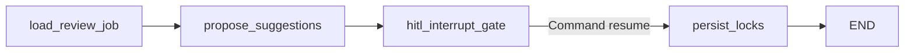

# LangGraph HITL dogfood (Scanner-only)

Production-pattern LangGraph graph for **cth-data-room-scanner**: load review findings → agent proposal → **`interrupt`** for human → resume with agree/override/defer → persist locks compatible with microworld schema and `/api/review/<job_id>/locks`.

## Understanding Lab (this ticket)

| Surface | URL |
|---------|-----|
| Context | https://app.notion.com/p/3d5dfee50be98174a045febce0fc4b3d |
| Playground | https://app.notion.com/p/3d9dfee50be981ab8bd4ff5fd40c8e35 |
| Shared decisions | https://app.notion.com/p/bb52cfa45b6744e59983528480fbab4b |

Override via env (`SCANNER_LAB_*`) for another ticket — do not treat these as universal defaults for LexiScan or other products.

## Install

```bash
pip install -r requirements.txt -r requirements-langgraph.txt
```

Pins: `langgraph==1.2.11`, `langgraph-checkpoint==4.2.0`, `langsmith==0.12.4`.

## Run locally (≤10 min human path)

```bash
# 1. Optional: generate fixture findings
make hitl-demo

# 2. Start graph — pauses at interrupt, prints thread_id + pending payload
python3 scripts/langgraph_dogfood.py start \
  --findings hitl/microworld/defaults/findings-hitl-20260908-214515.json

# 3. Human reviews in Understanding Lab, then resume:
python3 scripts/langgraph_dogfood.py resume \
  --thread-id <thread_id_from_step_2> \
  --decisions hitl/langgraph/fixtures/langgraph-decisions.example.json
```

One-shot smoke (no human):

```bash
python3 scripts/langgraph_dogfood.py start --auto-resume
```

Locks land next to findings: `{findings_stem}-review-locks.json`.

## LangSmith tracing (optional)

Keys live in **Infisical**, not in git. Env names only:

| Variable | Purpose |
|----------|---------|
| `LANGSMITH_API_KEY` | LangSmith API key |
| `LANGCHAIN_API_KEY` | Alias accepted by LangChain tracing |
| `LANGCHAIN_TRACING_V2` | Set `true` to enable |
| `LANGCHAIN_PROJECT` | Project name (default `cth-scanner-hitl-dogfood`) |

## Graph



## Tests

```bash
pytest tests/test_langgraph_review.py -v
```

## Related

- Microworld UI: `hitl/microworld/`
- Production reviewer (separate branch): `app/review.py`, `hitl/review/`
- Reference patterns: [langgraph-lab](https://github.com/gideonblaauw-creator/langgraph-lab) Modules 1–3
